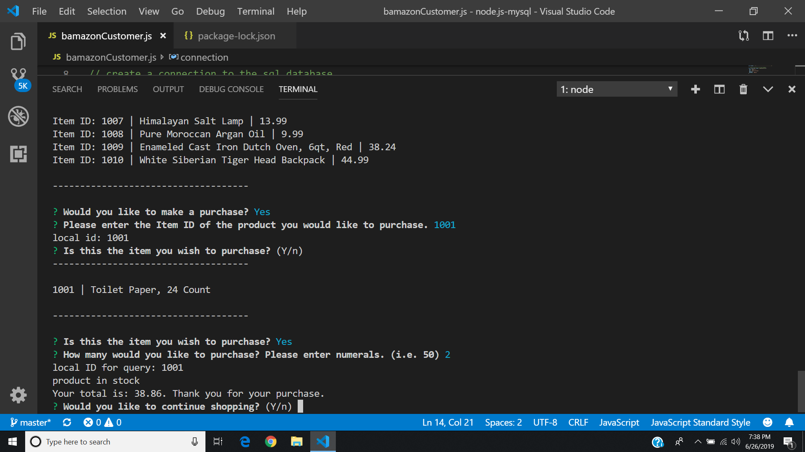

# node.js-mysql
This program uses node.js to create a CLI Application which allows users to interact with a MySQL database. The
application simulates a rudimentary storefront experience, allowing customers to view inventory and request(buy) items in
stock. Inquirer is used to guide users through use of the application.

#First screenshot:

this screenshot shows the ability of the user to choose the product he wants and the procedure in order to purchase it.

#Second Screenshoot:

shows the same things with the fisrt screenshot, but with different products.
